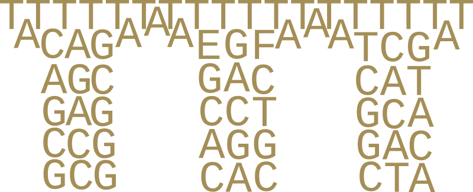

<p align="center">

</p>

# Sequeduct

Sequencing analysis pipeline (aqueduct) for validating plasmids and DNA assembly constructs, using long reads.

## TLDR

```bash
docker pull ghcr.io/edinburgh-genome-foundry/sequeduct:latest

nextflow run sequeduct_analysis.nf --fastq_dir='fastq' --reference_dir='ref' --sample_sheet='sample_sheet.csv' --projectname='EGF project' -with-docker ghcr.io/edinburgh-genome-foundry/sequeduct
```

## Build

```bash
cd containers
docker build --tag sequeduct .
```

## Usage

Create a directory for your project and copy (or link) the FASTQ directories from your Nanopore run (e.g. into `fastq`). Specify this together with a sample sheet in your commands:

```bash
# Preview
nextflow run sequeduct_preview.nf --fastq_dir='fastq' --sample_sheet='sample_sheet.csv'
# Analysis
nextflow run sequeduct_analysis.nf --fastq_dir='fastq' --reference_dir='ref' --sample_sheet='sample_sheet.csv' --projectname='EGF project' -with-docker sequeduct
# Review
nextflow run sequeduct_review.nf --reference_dir='ref' --results_csv='results.csv' --projectname='EGF project' --all_parts='part_sequences.fasta' --assembly_plan='assembly_plan.csv' -with-docker sequeduct
```

The above three commands each output a directory in `results`. Similarly, NextFlow creates and uses a directory named `work`, so ensure that your project directory doesn't have one.

## Copyright

Copyright 2021 Edinburgh Genome Foundry

Sequeduct was written at the [Edinburgh Genome Foundry](https://edinburgh-genome-foundry.github.io/)
by [Peter Vegh](https://github.com/veghp).
