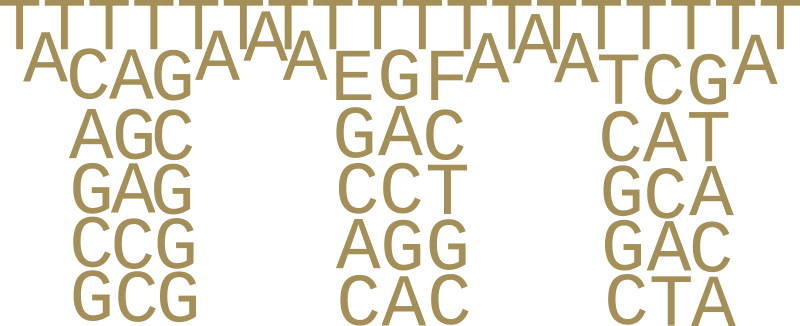

<p align="center">

</p>

# Sequeduct


Sequeduct (**seque**ncing aque**duct**) is a long read sequencing data analysis pipeline for validating plasmids and DNA assembly constructs.

An example analysis and demonstration data are available at the [Sequeduct demo](https://github.com/Edinburgh-Genome-Foundry/Sequeduct_demo) site.

#### Citation

Biofoundry-scale DNA assembly validation using cost-effective high-throughput long-read sequencing, *Peter Vegh, Sophie Donovan, Susan Rosser, Giovanni Stracquadanio, Rennos Fragkoudis.* [ACS Synthetic Biology](https://pubs.acs.org/doi/10.1021/acssynbio.3c00589) (2024) 13, 2, 683–686

## Usage

### Setup

Install [Nextflow](https://www.nextflow.io/).

Pull the Nextflow pipeline:

```bash
nextflow pull edinburgh-genome-foundry/Sequeduct -r v0.4.1
```

Note: Nextflow sometimes returns the error `Cannot find revision`, in which case try and run the same pull command again.

Install the software tools used by the pipeline in an Anaconda (Python 3.12) environment. Example instructions for Ubuntu (GNU/Linux) are provided in [install_sequeduct.sh](install_sequeduct.sh). Update the `PATH` variable in `~/.profile`, or otherwise make the installed bioinformatics tools available, before running the pipeline. 

Alternatively, create a Docker image and run the pipeline using a Docker container. Instructions are provided in [DOCKERISATION.md](DOCKERISATION.md). However, there is an issue with the latest version, as one of the tools (canu) does not work properly inside the container.


### Run

Create a directory for your project and copy (or link) the FASTQ directories from your Nanopore run (e.g. `fastq_pass`). Specify this together with a sample sheet in your commands:

```bash
# Preview
nextflow run edinburgh-genome-foundry/Sequeduct -r v0.4.1 -entry preview --fastq_dir='fastq_pass' \
    --reference_dir='genbank' \
    --sample_sheet='sample_sheet.csv'
# Analysis
nextflow run edinburgh-genome-foundry/Sequeduct -r v0.4.1 -entry analysis --fastq_dir='fastq_pass' \
    --reference_dir='genbank' \
    --sample_sheet='sample_sheet.csv' \
    --projectname='EGF project'
# Review
nextflow run edinburgh-genome-foundry/Sequeduct -r v0.4.1 -entry review --reference_dir='genbank' \
    --results_csv='results_sheet.csv' \
    --projectname='EGF project review' \
    --all_parts='parts_fasta/part_sequences.fasta' \
    --assembly_plan='assembly_plan.csv'
# De novo assembly
nextflow run edinburgh-genome-foundry/Sequeduct -r v0.4.1 -entry assembly --fastq_dir='fastq_pass' \
    --assembly_sheet='assembly_sheet.csv'
```

The above commands each output a directory within a created `results` directory. Similarly, Nextflow creates and uses a directory named `work`, so ensure that your project directory doesn't have a directory with the same name. Specify revision of the project with `-r` (a git branch or tag), and choose a configuration profile (with `-profile`). Profiles are specified in the Nextflow config files. The Review pipeline utilises the output files of the Analysis pipeline, but otherwise the pipelines are independent. Please find example sheets in the `examples` directory.

A more detailed example and demonstration data are available at the [Sequeduct demo](https://github.com/Edinburgh-Genome-Foundry/Sequeduct_demo) site.

### Details

For simplicity, the names in the sample sheet are used for finding the reference Genbank files, therefore sample names must match filenames with a ".gb" extension.

Enable the barcode trimming option during the sequencing run. This will ensure that full-length read size will match the plasmid size, and that there are no unaligned sections in the reads.

If you have the FASTQ files in gzip compressed format (`.gz`), then you must uncompress them (e.g. run `gunzip --recursive *` in the FASTQ folder).

Note that canu v2.2, used by older versions of the pipeline, requires minimum 100 reads, otherwise it returns an error. The latest version of the pipeline uses canu v2.3 which has [this issue fixed](https://github.com/marbl/canu/issues/2035).

For convenience, a script is included to collect plot files from the result directories (`bin/collect_plots.py`).

An existing log file from a previous run can prevent re-running the pipeline or resuming a run.
In that case, add the below in your nextflow config file (in Ubuntu: `$HOME/.nextflow/config`). (Create the file if it doesn't exist.)

```
	report.overwrite = true
	timeline.overwrite = true
```

The pipeline was designed to work with data from one or more barcodes (FASTQ subdirectories). It has been tested on a desktop machine running Ubuntu 
24.04.1 LTS (Memory: 32.0 GiB; CPU: Intel® Core™ i5-9500 × 6). An older version of the pipeline was tested on Ubuntu 20.04.6 LTS (Memory: 15.5 GiB; CPU: Intel® Core™ i5-6500 CPU @ 3.20GHz × 4), and confirmed to work with up to 96 barcodes. The largest tested dataset was 1.5 GB Nanopore FASTQ data, resulting in 1.1 GB filtered data (100k filtered reads) with up to 55 MB individual filtered FASTQ files (i.e. per sample). If the dataset is much larger, then it may return an error at the variant call or another step. A recommended solution is to increase the quality cutoff (with parameter `--quality_cutoff`), and optionally the minimum length cutoff (`--min_length`), to work with fewer but better reads.

## License = GPLv3+

Copyright 2021 Edinburgh Genome Foundry, University of Edinburgh

Sequeduct was designed by [Giovanni Stracquadanio](https://github.com/stracquadaniolab/) and Peter Vegh. It's implemented in Nextflow by [Peter Vegh](https://github.com/veghp) at the [Edinburgh Genome Foundry](https://edinburgh-genome-foundry.github.io/), and is released under the GPLv3 license.
